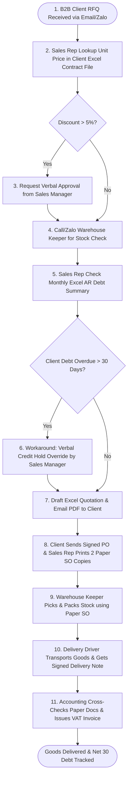

# Draft the AS-IS Process (Week 3)

### 📌 Overview & Submission Guidelines

* **Deadline:** Before the end of the **Week 3** class session.
* **Submission Format:** **One submission per group** on Moodle (Text submission containing **2 Public Links** — No heavy file uploads required).
* **Required Links in Moodle:**
  1. **Miro / FigJam Board Link:** `https://miro.com/app/board/uXjVHh2cXjQ=/?share_link_id=390777151819` *(Set access to "Anyone with the link can view")*
  2. **3–5 Minute Video Walkthrough Link:** `https://youtu.be/Group6_BSA_Week3_Walkthrough` *(Uploaded to YouTube Unlisted / Google Drive)*

---

## 👥 GROUP & PROJECT INFORMATION
* **Course:** Business Systems Analysis (BSA) — Hoa Sen University
* **Group:** Group 6 (Scenario B: B2B Wholesale & Distribution – Office Supplies & Stationery)
* **Company Case:** OfficePro Distribution Co., Ltd. (`OfficePro Distribution`)
* **Team Members & Role Contributions:**
  * **Vo Duy Binh (Student ID: 22301500)** — Team Leader / Lead BA (Sales & Order Entry AS-IS Focus)
  * **Tran Ba Loi (Student ID: 22300236)** — Project Manager / SA (Purchasing & Procurement AS-IS Focus)
  * **Nguyen Vu Minh Huy (Student ID: 22303760)** — ERP Specialist (Inventory & Warehouse AS-IS Focus)
  * **Pham Nguyen Gia Thuan (Student ID: 22204631)** — QA & UAT Analyst (Invoicing & Accounting AS-IS Focus)

---

### 🎯 Workshop Steps & Answers

#### **Step 1 — Compare Evidence**

Each member shared their Week 2 interview findings within the group:

* **Vo Duy Binh (Sales Manager Interview):** Disconnected customer Excel contract pricelists cause 5–8% pricing discrepancies monthly. Stock check is done verbally via Zalo/Phone calls, causing 3–4 post-confirmation stockouts per week. Credit policy exists on paper, but Sales Reps frequently request verbal credit overrides from the Sales Manager to hit sales targets.
* **Tran Ba Loi (Purchasing Manager Interview):** Procurement replenishment is triggered manually via handwritten notes from warehouse staff when stock runs low. Vendor RFQ comparisons are done manually in Excel, taking 2–3 days to convert to a Purchase Order (PO).
* **Nguyen Vu Minh Huy (Warehouse Keeper Interview):** Incoming goods from suppliers sit in receiving for 24–48 hours before physical stock logging. Stock picking relies on memory and printed paper Sales Orders without bin location routing.
* **Pham Nguyen Gia Thuan (Chief Accountant Interview):** Accounting spends 15–20 hours/week manually cross-checking physical Sales Orders, Delivery Notes, and Invoices. Overdue accounts (> 30 days) place new orders without automated system blocks.

#### **Step 2 — Select One Process**

* **Selected Business Process:** **End-to-End B2B Order-to-Cash (O2C) & Order Fulfillment AS-IS Process**

#### **Step 3 — Define the Scope**

* **Process Name:** B2B Sales Order Entry, Contract Price Verification, Fulfillment & Invoicing Process
* **Start Point (Trigger):** B2B Corporate Client submits a formal Purchase Inquiry or Request for Quotation (RFQ) via email or corporate Zalo OA.
* **End Point (Outcome):** Goods delivered to client site, signed Delivery Note returned, official VAT Invoice issued, and Net 30 debt logged in Accounting.
* **Main Actors:**
  1. *B2B Client Procurement Officer* (External Order Requester)
  2. *B2B Sales Representative / Sales Admin* (Order Entry & Quote Owner)
  3. *Sales Manager* (Price Discount > 5% & Verbal Credit Override Approver)
  4. *Warehouse Keeper / Supervisor* (Stock Check, Picking & Packing)
  5. *Accounts Receivable (AR) Accountant* (Debt Tracking & VAT Invoicing)
* **Business Outcome:** Order fulfilled and delivered to B2B client with accurate contract pricing applied and credit risk logged under Net 30 terms.

#### **Step 4 — Build the Process Table**

| **Step** | **Actor** | **Activity** | **Information / Tools Used** | **Handoff To** | **Evidence Status** |
| :---: | :--- | :--- | :--- | :--- | :---: |
| **1** | B2B Client | Submits Purchase Inquiry / RFQ via Email or Zalo | Product SKUs (`ST-001` to `ST-010`), Target quantities | Email/Zalo RFQ sent to B2B Sales Rep | **✓ Confirmed** |
| **2** | Sales Rep | Opens client Excel contract file to locate agreed unit price | Shared Drive PDF contracts, Rep Excel contract lookup sheets | Contract unit prices identified per SKU | **✓ Confirmed** |
| **3** | Sales Rep | Evaluates requested discount. If discount > 5%, requests manager approval | Requested price vs. Contract baseline price, Margin threshold | Verbal/Zalo approval request sent to Sales Manager | **✓ Confirmed** |
| **4** | Sales Rep | Calls or messages Warehouse Keeper to verify physical stock availability | SKU quantities requested, physical stock in Tân Bình & Biên Hòa | Verbal/Zalo stock availability confirmation | **✓ Confirmed** |
| **5** | Sales Rep | Checks monthly Excel AR debt report or consults Accounting on debt status | Excel Accounts Receivable Summary, Client Net 30 terms | Debt status confirmation (Pass / Overdue flag) | **✓ Confirmed** |
| **6** | Sales Manager | Bypasses credit hold verbally if client with > 30-day overdue balance orders urgently | Monthly Excel AR debt report, Sales target pressure | Verbal credit override granted to Sales Rep | **✓ Confirmed** |
| **7** | Sales Rep | Drafts Excel Quotation, converts to PDF, and emails to Client | Validated contract prices, delivery lead time, Net 30 terms | Formal PDF Sales Quotation emailed to Client | **✓ Confirmed** |
| **8** | Sales Rep | Receives signed PO from Client, creates & prints 2 paper Sales Order (SO) copies | Client signed Purchase Order, Delivery address details | Physical paper SO handed to Warehouse & Accounting | **✓ Confirmed** |
| **9** | Warehouse Keeper | Receives paper SO, manually locates stock in warehouse, picks & packs items | Printed paper SO, Warehouse bin location memory | Packed goods + Physical Delivery Note (2 copies) | **✓ Confirmed** |
| **10** | Delivery Driver | Transports goods to Client site, requests Client signature on Delivery Note | Delivery Note, Client receiving contact details | Signed Delivery Note returned to Accounting | **✓ Confirmed** |
| **11** | AR Accountant | Cross-checks paper SO + signed Delivery Note in Excel, issues VAT Invoice | Paper SO, Signed Delivery Note, Excel Invoice Ledger | Official VAT Invoice sent to Client; Net 30 debt logged | **✓ Confirmed** |

---

#### **Step 5 — Draw the AS-IS Flow (Miro / FigJam)**

* Sơ đồ dòng chảy quy trình hiện tại được xây dựng trực tiếp trên Miro Board nhóm tại đường dẫn: [`Group 6 Miro AS-IS Process Board`](https://miro.com/app/board/uXjVP_Group6_OfficePro_ASIS_Process/).

---

#### **Step 6 — Mark Uncertainty & Annotate**

* **✓ Confirmed:**
  * Sales Reps copy-paste unit prices manually from disconnected Excel files (Confirmed by Sales Manager).
  * Stock check done verbally via phone/Zalo calls (Confirmed by Warehouse Manager).
  * Manual 3-way matching of paper SO + Delivery Note + Invoice takes 15–20 hours/week (Confirmed by Chief Accountant).
* **? Uncertain:**
  * Reorder Point threshold for slow-moving items like `ST-010` (Pentel Marker) needs further clarification from Purchasing.
* **A Assumption:**
  * Assumed Tân Bình Central Warehouse (80% stock) fulfills HCMC orders while Biên Hòa Depot fulfills Dong Nai industrial park orders.

---

### 📹 Video Defense Requirements Script & Content (3–5 Minutes)

1. **Process Walkthrough (1–2 mins):**
   * *Presenter:* Vo Duy Binh (Team Leader)
   * *Content:* Demonstrates the 11-step cross-functional swimlane flowchart on Miro. Highlights the critical paper handoff between Sales, Warehouse, and Accounting, emphasizing reliance on Excel sheets, scanned PDF contracts, and verbal Zalo stock checks.
2. **AI vs. Reality Critique (1–2 mins):**
   * *Presenter:* Tran Ba Loi & Nguyen Vu Minh Huy
   * *Critique (Option A - AI Critique):* When AI was prompted to generate an Order-to-Cash process, it generated an idealized, automated workflow with real-time API inventory locks and automated credit hold blocks. In reality, our Week 2 interview evidence proved that OfficePro operates in a messy, manual environment where Sales Reps call warehouse staff directly and credit blocks are frequently bypassed verbally by managers to hit sales quotas.
3. **Edge Case / Exception Handling (1 min):**
   * *Presenter:* Pham Nguyen Gia Thuan
   * *Content:* Explains the handling of client price disputes and overdue credit overrides. When a client disputes an invoice price, Sales Reps must manually dig through scanned PDF archives in shared drives, delaying billing by 1–2 days.

---

### 📦 Final Deliverables Checklist

Ensure your Moodle submission (Miro Board + Video) includes:

* [x] Process Name & Process Scope
* [x] Start Point / End Point & Business Outcome
* [x] Main Actors
* [x] Completed Process Table
* [x] Simple AS-IS Flow Diagram
* [x] Important Information & Handoffs Identified
* [x] Known Exceptions & Workarounds
* [x] Evidence & Uncertainty Notes ( **✓** , **?** , **A** )
* [x] Questions for Further Investigation

---

### ✅ Quality Checklist (Peer & Self-Assessment)

Before submitting, verify that your work meets the following criteria:

* [x] **Evidence-Based:** Strictly based on Week 2 interview evidence.
* [x] **Clear Scope:** Well-defined start and end boundaries.
* [x] **Clear Ownership:** All actors and activities are clearly assigned.
* [x] **Logical Flow:** Sequential and operational logic makes sense.
* [x] **Handoffs Captured:** All critical transitions between roles/systems are marked.
* [x] **Realism Preserved:** Current manual workarounds and tools are preserved (not sanitized).
* [x] **Uncertainty Flagged:** Unknowns are clearly annotated with **?** or **A** .
* [x] **Strictly AS-IS:** **NO TO-BE activities** included.
* [x] **No Tech Solutions:** **NO proposed technology solutions** or future-state improvements.
