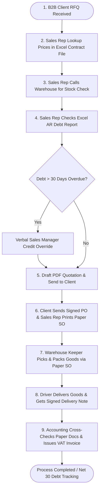

================================================================================
          GROUP DELIVERABLE WEEK 3 - GROUP 6 (SCENARIO B: B2B WHOLESALE)
================================================================================

# GROUP WORKSHOP REPORT: AS-IS BUSINESS PROCESS DRAFT

## GROUP & COURSE INFORMATION
* **Course**: Business Systems Analysis (BSA) — Hoa Sen University
* **Group**: Group 6 (Scenario B: B2B Wholesale & Distribution – Office Supplies & Stationery)
* **Company Case**: OfficePro Distribution Co., Ltd. (`OfficePro Distribution`)
* **Team Members & Role Contributions**:
  * **Vo Duy Binh (Student ID: 22301500)** — Team Leader / Lead BA (Sales & Order Entry AS-IS Focus)
  * **Tran Ba Loi (Student ID: 22300236)** — Project Manager / SA (Purchasing & Procurement AS-IS Focus)
  * **Nguyen Vu Minh Huy (Student ID: 22303760)** — ERP Specialist (Inventory & Warehouse AS-IS Focus)
  * **Pham Nguyen Gia Thuan (Student ID: 22204631)** — QA & UAT Analyst (Invoicing & Accounting AS-IS Focus)

---

## 1. PROCESS NAME & SCOPE DEFINITION

* **Selected Business Process**: **End-to-End Order-to-Cash (O2C) & Order Fulfillment AS-IS Process**
* **Process Scope**: Covers customer inquiry receipt, contract price lookup, stock availability verification, credit checking, sales order issuance, warehouse picking & delivery, and accounts receivable invoicing.
* **Start Point (Trigger)**: B2B Corporate Client submits a formal Purchase Inquiry or RFQ via email/Zalo to Sales.
* **End Point (Outcome)**: Goods delivered to client site, signed Delivery Note returned, and VAT Invoice issued by Accounting with Net 30 debt tracking logged.
* **Main Actors**:
  1. *B2B Sales Representative* (Sales Department)
  2. *Sales Manager* (Sales Department — Price & Credit Override Approver)
  3. *Warehouse Keeper / Supervisor* (Tân Bình Central Warehouse & Biên Hòa Depot)
  4. *Purchasing Officer* (Procurement Department — Stock Replenishment)
  5. *Accounts Receivable (AR) Accountant* (Accounting Department — Invoicing & Credit Control)
  6. *B2B Client Procurement Officer* (External Stakeholder)

---

## 2. CROSS-FUNCTIONAL AS-IS PROCESS TABLE

| Step | Actor | Activity / Task | Information Used / Consulted | Output / Handoff |
| :---: | :--- | :--- | :--- | :--- |
| **1** | B2B Client | Sends product list & requested delivery date via Email/Zalo. | Product SKUs (`ST-001` to `ST-010`), Target quantities. | RFQ / Inquiry document handed off to B2B Sales Rep. |
| **2** | Sales Rep | Opens client Excel contract file to locate agreed contract unit prices. | Shared Drive PDF contracts, Rep Excel contract lookup sheets. | Contract unit prices identified per requested SKU. |
| **3** | Sales Rep | Calls/Zalo messages Warehouse Keeper to verify physical stock. | SKU quantities requested, physical stock in Tân Bình / Biên Hòa. | Verbal / Zalo stock availability report from Warehouse. |
| **4** | Sales Rep | Checks monthly Excel AR debt report or consults Accounting on debt status. | Excel Accounts Receivable Summary, Client Net 30 terms. | Debt balance status (Pass / > 30 Days Overdue). |
| **5** | Sales Rep | Drafts Excel Quotation, converts to PDF, and emails to Client. | Validated contract prices, delivery lead time, payment terms. | Formal PDF Sales Quotation emailed to Client. |
| **6** | Sales Rep | Receives signed PO from Client, creates & prints 2 paper Sales Order (SO) copies. | Client signed Purchase Order, Delivery address details. | Printed SO handed to Warehouse (Picking) & Accounting (Billing). |
| **7** | Warehouse Keeper | Receives paper SO, manually locates stock in warehouse, picks & packs items. | Printed paper SO, Warehouse bin location memory. | Goods packed + Physical Delivery Note (2 copies). |
| **8** | Delivery Driver | Transports goods to Client site, requests Client signature on Delivery Note. | Delivery Note, Client receiving contact details. | Signed Delivery Note returned to Accounting. |
| **9** | AR Accountant | Cross-checks paper SO + signed Delivery Note in Excel, issues VAT Invoice. | Paper SO, Signed Delivery Note, Excel Invoice Ledger. | Official VAT Invoice sent to Client; Net 30 debt logged. |

---

## 3. SIMPLE AS-IS FLOWCHART

---

## 4. IMPORTANT INFORMATION & HANDOFFS

### A. Core Information Artifacts Used
* **Customer Contract Pricelists**: Separate Excel spreadsheets maintained per sales rep, leading to price version discrepancies.
* **Master Product Catalog**: 10 core SKUs (`ST-001` A4 Paper Double A to `ST-010` Pentel Whiteboard Marker).
* **Accounts Receivable Summary**: Monthly Excel report generated by Accounting to track Net 30 client debt.
* **Delivery Note & Sales Order**: Printed paper documents passed physically between departments.

### B. Critical Inter-Departmental Handoffs
1. **Sales ➔ Warehouse**: Physical transfer of paper Sales Order for picking instruction.
2. **Delivery ➔ Accounting**: Physical return of signed Delivery Note to confirm fulfillment.
3. **Accounting ➔ Sales**: Monthly email/verbal update regarding client credit blocks.

---

## 5. KNOWN EXCEPTIONS & WORKAROUNDS

* **Exception 1 — Pricing Discrepancy Dispute**: Client disputes invoice unit price citing contract terms.  
  * *Workaround*: Sales rep manually searches shared drive PDF archives to verify original contract terms, delaying billing by 1–2 days.
* **Exception 2 — Post-Confirmation Stockout**: Warehouse discovers physical stock shortage after order confirmation.  
  * *Workaround*: Sales calls client to negotiate split shipment or SKU substitution (e.g., substituting Double A 70gsm with IK Plus 80gsm).
* **Exception 3 — Manual Credit Hold Override**: Client with > 30-day overdue balance places an urgent order.  
  * *Workaround*: Sales rep obtains verbal approval from Sales Manager to release the order manually without Accounting system validation.

---

## 6. EVIDENCE & UNCERTAINTY NOTES

| Process Element | Evidence Status | Notes / Source Basis |
| :--- | :---: | :--- |
| **Excel Contract Lookup** | **✓ Confirmed** | Confirmed by Sales Manager: Prices copy-pasted manually from individual Excel sheets. |
| **Phone/Zalo Stock Verification** | **✓ Confirmed** | Confirmed by Warehouse Manager & Sales Manager: No real-time inventory system shared with Sales. |
| **Manual 3-Way Matching** | **✓ Confirmed** | Confirmed by Chief Accountant: 15–20 hours/week spent comparing paper SOs, Delivery Notes, and Invoices. |
| **Purchasing Requisition Trigger** | **? Uncertain** | Evidence indicates low stock alerts are communicated verbally/handwritten from warehouse keepers; exact threshold per SKU needs confirmation. |
| **Depot Fulfillment Priority** | **A Assumption** | Assumed Tân Bình warehouse fulfills HCMC orders while Biên Hòa depot fulfills Dong Nai industrial park orders. |

---

## 7. QUESTIONS FOR FURTHER INVESTIGATION

1. **Reorder Point Thresholds**: What exact quantitative minimum stock level triggers a Purchase Requisition for fast-moving items like `ST-001` (A4 Paper 70gsm) versus slow-moving items like `ST-010` (Pentel Whiteboard Marker)?
2. **Damaged Goods / Returns Handling**: What is the current manual process and paper handoff when a client rejects goods at delivery due to damage or incorrect SKU delivery?

---

## 8. QUALITY CHECKLIST VERIFICATION

* [x] **Based on Week 2 interview evidence**: Built directly on interview evidence from Sales Manager, Purchasing, Warehouse, and Accounting.
* [x] **Clear process scope**: Order-to-Cash & Fulfillment process clearly bounded from RFQ receipt to VAT Invoicing.
* [x] **Logical sequence & handoffs**: 9-step cross-functional workflow with clear paper and verbal handoffs.
* [x] **Current tools/workarounds preserved**: Excel sheets, Zalo calls, physical paper SOs, and verbal overrides documented.
* [x] **Uncertainty clearly marked**: Confirmed (✓), Uncertain (?), and Assumptions (A) explicitly tagged.
* [x] **No TO-BE activities or technology proposed**: Focuses strictly on current AS-IS operations.
