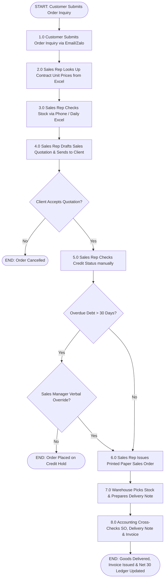

FROM INTERVIEW EVIDENCE TO AS-IS PROCESS MAP
CONNECTING CLASS SIMULATION TO THIS ASSIGNMENT
In our in-class Simulation, you experienced how manual handoffs, missing data, and uncoordinated roles cause process bottlenecks. Now, apply those same insights to your Week 2 Interview data to model the real, current state (AS-IS) of your assigned business.

🚨 Core Rule: Describe WHAT IS, not WHAT SHOULD BE. Do NOT add new software, automation, or process improvements yet. Capture all friction, manual delays, and data gaps as they currently exist.

📝 SUBMISSION REQUIREMENTS

1. Process Metadata
   Process Name: Use [Verb] + [Noun] format (e.g., Processing Customer Refund).

Trigger: The exact event starting the process (e.g., Customer submits a claim).

End Point: The final state upon completion (e.g., Refund issued & account updated).

Main Actors: Roles/departments involved (e.g., CS Rep, Warehouse Clerk, Finance).

2. AS-IS Process Table
   Step	Actor	Activity (Verb + Noun)	Information / Input Used	Output / Handoff	Evidence Status
   1.0	Customer	Submits return request	Order receipt, Item photo	Return Form -> CS Rep	Confirmed
   2.0	CS Rep	Verifies return policy	Warranty rules	Approval status -> Warehouse	Confirmed
   3.0	Warehouse	Checks stock availability	Physical inventory	Stock Slip -> Accounting	Uncertain (No system)
   Writing Guidelines:

Step: Sequential numbers (1.0, 2.0, ...).

Activity: Start with an action verb (e.g., "Inspect returned goods", NOT "Warehouse").

Information: Exact forms, paper documents, or data attributes passed along.

Evidence Status: Mark each step as Confirmed (from interview), Uncertain (vague details), or Assumption (logical guess).

3. Simple AS-IS Flowchart
   Draw a basic flowchart strictly matching your Process Table (1-to-1 correlation):

🟢 Oval: Start Event (Trigger) & End Event (End Point).

🟦 Rectangle: Activity step.

🔷 Diamond: Decision gate (Yes / No).

4. Diagnostic & Unresolved Questions
   Simulation Takeaway: Identify at least 1 major friction point (bottleneck, manual delay, or missing data handoff) in this AS-IS flow.

Unresolved Questions: Write 1–2 specific follow-up questions needed to clarify remaining gaps in your next interview.

✅ SELF-CHECKLIST
[ ] Activities are named using [Verb] + [Noun] phrasing.

[ ] Flowchart blocks map 1-to-1 with the Process Table rows.

[ ] No future technology or process fixes are proposed.

[ ] Document fits cleanly within 1–2 pages PDF.

---

# GROUP 6 SOLUTION — WEEK 4
## FROM INTERVIEW EVIDENCE TO AS-IS PROCESS MAP

**Course:** Business Systems Analysis (BSA)  
**Academic Year:** 2026–2027 | Semester 1  
**Group:** Group 6 — Scenario B: B2B Wholesale & Distribution (Office Supplies & Stationery)  
**Enterprise Case:** OfficePro Distribution Co., Ltd.  

**Active Team Members:**
- **Vo Duy Binh (Student ID: 22301500)** — Team Leader / Lead BA & SA (Sales & Purchasing Focus)
- **Pham Nguyen Gia Thuan (Student ID: 22204631)** — QA & Solution Configurator (Inventory & Accounting Focus)

---

### 1. PROCESS METADATA

* **Process Name:** Fulfilling B2B Corporate Orders with Contract Pricing
* **Trigger:** Corporate B2B Customer submits an order inquiry via email or Zalo OA containing product list and quantities.
* **End Point:** Physical goods delivered to customer premises, signed Delivery Note returned, customer VAT invoice issued, and Net 30 debt account updated.
* **Main Actors:**
  1. *B2B Customer* (Corporate Client / Educational Institution / Sub-dealer)
  2. *Sales Representative* (Vo Duy Binh — B2B Sales Department)
  3. *Warehouse Keeper* (Pham Nguyen Gia Thuan — Tan Binh Central Warehouse)
  4. *Purchasing Officer* (Vo Duy Binh — Procurement Department)
  5. *Accounts Receivable Accountant* (Pham Nguyen Gia Thuan — Finance & Accounting)

---

### 2. AS-IS PROCESS TABLE

| Step | Actor | Activity (Verb + Noun) | Information / Input Used | Output / Handoff | Evidence Status |
|:---:|---|---|---|---|:---:|
| **1.0** | **B2B Customer** | Submits Order Inquiry | Purchase List, Requested Delivery Date | Purchase Inquiry Email/Zalo ➔ Sales Rep | **Confirmed** |
| **2.0** | **Sales Rep** | Looks Up Contract Unit Prices | Customer Contract PDF, Rep's Personal Excel Pricelist | Quoted Unit Prices (`ST-001` @ 65,000 VND) | **Confirmed** |
| **3.0** | **Sales Rep** | Checks Physical Stock Availability | Yesterday's Excel Stock Summary Report / Phone Call | Stock Availability Verification ➔ Warehouse | **Confirmed** |
| **4.0** | **Sales Rep** | Drafts Sales Quotation | Quoted Prices, Customer Details | Draft Quotation PDF ➔ Customer | **Confirmed** |
| **5.0** | **Sales Rep** | Verifies Customer Credit Status | Physical Credit Policy Document | Debt Clearance Status ➔ Accounting | **Uncertain** *(Policy on paper, but bypassable)* |
| **6.0** | **Sales Rep** | Issues Paper Sales Order (SO) | Signed Quotation from Customer | Printed Paper Sales Order ➔ Warehouse & Accounting | **Confirmed** |
| **7.0** | **Warehouse** | Picks and Packs Stock | Paper SO, Memory of Bin Shelves | Packed Box Goods & Physical Delivery Note | **Confirmed** |
| **8.0** | **Accounting** | Executes Manual 3-Way Invoice Match | Paper SO, Signed Delivery Note, Excel Billing File | Customer VAT Invoice & Net 30 Debt Ledger Entry | **Confirmed** |

---

### 3. SIMPLE AS-IS FLOWCHART

---

### 4. DIAGNOSTIC & UNRESOLVED QUESTIONS

#### 4.1. Simulation Takeaway (Major Operational Friction Points)
1. **Contract Pricing Error Bottleneck (Sales Silo):** Because contract pricing agreements are stored in disconnected personal Excel files maintained independently by each Sales Rep, manual copy-pasting into client quotations causes a **5–8% error rate on monthly customer invoices**. This results in frequent client billing disputes and manual credit note adjustments.
2. **Post-Confirmation Stockout Lag (Warehouse Silo):** Sales Reps confirm orders based on morning Excel stock dumps or informal phone calls to warehouse staff. Goods receiving takes 24–48 hours before physical inventory updates are recorded, causing **3–4 stockouts per week post-confirmation** and forced order cancellations.
3. **Manual 3-Way Matching Overhead (Accounting Silo):** Accounts Receivable spends **15–20 hours per week** manually cross-checking printed paper Sales Orders, physical driver-signed Delivery Notes, and Excel billing files. Hard credit hold policies for accounts overdue > 30 days are frequently bypassed via informal verbal manager appeals.

#### 4.2. Unresolved Questions for Next Stakeholder Interview
1. **For Sales Manager:** *"What is the exact official protocol and threshold for approving price overrides or granting verbal credit hold exceptions for long-standing corporate clients with overdue debt > 30 days?"*
2. **For Warehouse Manager:** *"What is the specific step-by-step delay between a supplier truck arriving at the receiving bay and the physical inventory becoming visible for Sales Representatives to quote to clients?"*

---

