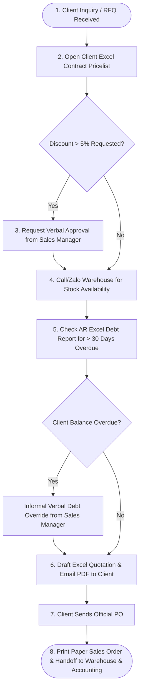

# ASSIGNMENT PROMPT & INSTRUCTIONS

## From Interview Evidence to AS-IS Process
### Individual Assignment

**Task:**  
Use your Week 2 Interview Evidence Log to create an initial AS-IS process draft.

**Include:**
1. **Process Information**: Process Name, Trigger, End Point, Main Actors
2. **Process Table**: Step | Actor | Activity | Information | Output / Handoff
3. **Simple AS-IS Flow**: A simple flowchart is sufficient.
4. **Evidence Status**: Confirmed, Uncertain, Assumption
5. **Unresolved Questions**: Write 1–2 questions that need further clarification.

**Important:**  
Describe the current process. Do not propose a new system or technology solution.

**Submission:**  
Individual | PDF | 1–2 pages | Suggested filename: `W3_ASIS_[StudentID]_[Name].pdf`

---
================================================================================
          INDIVIDUAL DELIVERABLE WEEK 3 - VO DUY BINH (ID: 22301500)
================================================================================

# INDIVIDUAL ASSIGNMENT: FROM INTERVIEW EVIDENCE TO AS-IS PROCESS DRAFT

## STUDENT & COURSE INFORMATION
* **Student Name**: Vo Duy Binh
* **Student ID**: 22301500
* **Course**: Business Systems Analysis (BSA) — Hoa Sen University
* **Group**: Group 6 (Scenario B: B2B Wholesale & Distribution – Office Supplies & Stationery)
* **Assigned Role**: Team Leader / Lead Business Analyst (Sales & Customer Orders Focus)
* **Company Case**: OfficePro Distribution Co., Ltd. (`OfficePro Distribution`)

---

## 1. PROCESS INFORMATION

* **Process Name**: B2B Sales Order Entry, Contract Price Verification & Order Confirmation Process
* **Process Trigger**: Receipt of a Purchase Inquiry or Request for Quotation (RFQ) from a Corporate B2B Client (via Email, Corporate Zalo OA, or Phone).
* **End Point**: Confirmed paper Sales Order (SO) printed and physically handed off to the Warehouse for stock picking and forwarded to Accounting for invoicing and credit tracking.
* **Main Actors**:
  1. *B2B Sales Representative / Sales Admin* (Primary Process Owner)
  2. *Sales Manager* (Approver for custom price discounts > 5%)
  3. *Corporate B2B Client Procurement Officer* (External Order Requester)
  4. *Warehouse Keeper* (Inventory Check & Picking Recipient)
  5. *Accounts Receivable (AR) Accountant* (Debt & Credit Check Recipient)

---

## 2. PROCESS TABLE (AS-IS DETAILED STEPS)

| Step | Actor | Activity | Information Used | Output / Handoff |
| :---: | :--- | :--- | :--- | :--- |
| **1** | B2B Client | Submits Purchase Inquiry or RFQ with product list & quantities. | Product list, target quantities, desired delivery date. | Email / Zalo RFQ sent to B2B Sales Rep. |
| **2** | Sales Rep | Receives inquiry, identifies client account, and opens customer Excel contract pricelist file. | Customer Account ID, Master Product SKU catalog (`ST-001` to `ST-010`), Excel Contract Pricelist. | Located contract unit price per SKU. |
| **3** | Sales Rep | Evaluates requested volume discount. If discount > 5% beyond contract, requests manual approval. | Requested price vs. Contract baseline price, Margin threshold. | Verbal / Zalo approval request sent to Sales Manager. |
| **4** | Sales Rep | Calls or messages Warehouse Keeper to check physical stock availability across Tân Bình & Biên Hòa warehouses. | SKU codes, requested quantities, physical stock status. | Verbal / Zalo stock availability confirmation from Warehouse. |
| **5** | Sales Rep | Checks monthly Excel AR debt report or calls Accounting to verify client payment status (> 30 days overdue). | Customer AR Debt Summary (Excel sheet), Credit Limit ($/VND). | Debt status confirmation (Pass / Overdue flag). |
| **6** | Sales Rep | Drafts formal Quotation in Excel, converts to PDF, and emails to B2B Client for sign-off. | Contract unit prices, validated stock, payment terms (Net 30). | PDF Quotation emailed to Client. |
| **7** | Sales Rep | Receives signed Purchase Order (PO) from Client, issues paper Sales Order (SO), prints 2 copies, and distributes. | Client signed PO, Approved SO details, Delivery address. | Physical paper SO handed to Warehouse (Picking) & Accounting (Billing). |

---

## 3. SIMPLE AS-IS FLOWCHART

---

## 4. EVIDENCE STATUS CLASSIFICATION

The operational activities identified in the AS-IS process are classified below based on evidence obtained from the Week 2 Sales Manager interview:

| Process Step / Element | Evidence Status | Explanation & Source Notes |
| :--- | :---: | :--- |
| **Contract Price Lookup via Excel** | **✓ Confirmed** | Confirmed by Sales Manager: Each sales rep opens separate customer Excel files to locate contract unit prices manually. |
| **Verbal / Phone Stock Verification** | **✓ Confirmed** | Confirmed by Sales Manager: Sales reps call or text warehouse staff to check stock because no real-time stock system is visible to Sales. |
| **Discounts > 5% Manager Approval** | **✓ Confirmed** | Confirmed by Sales Manager: Standard company policy requires manager sign-off for non-standard pricing. |
| **Paper-Based Sales Order Handoff** | **✓ Confirmed** | Confirmed by Sales Manager: Printed paper SO copies are physically brought to the warehouse and accounting desk. |
| **Credit Hold Enforcement System** | **? Uncertain** | Evidence shows credit policy exists on paper, but enforcement is manual; it is uncertain how often Accounting intercepts orders versus Sales Reps bypassing credit holds. |
| **Warehouse Inter-Depot Transfer Rule** | **A Assumption** | Assumed that if Tân Bình warehouse runs out of stock (`ST-001`), sales reps manually request stock transfer from Biên Hòa depot without formal system routing. |

---

## 5. UNRESOLVED QUESTIONS FOR FURTHER CLARIFICATION

1. **Expired Framework Contract Protocol**: When a corporate client's annual framework contract pricing agreement expires while an inquiry is being processed, what exact step does the Sales Rep follow? Is there a formal price extension approval, or do reps default to standard list prices?
2. **Post-Confirmation Stockout Escalation**: When a stock shortage is discovered *after* a Sales Order has already been confirmed and handed to the warehouse, what is the exact escalation path between Sales and Client (e.g., partial delivery vs. SKU substitution)?

---

## 6. QUALITY CHECKLIST & AS-IS BOUNDARY CONFIRMATION

* [x] **Based strictly on Week 2 interview evidence**: All steps represent empirical evidence gathered from the Sales Manager interview.
* [x] **Clear process scope**: Focuses strictly on B2B Sales Order entry, contract pricing, stock checking, and order confirmation.
* [x] **Current tools/workarounds preserved**: Retains Microsoft Excel, Zalo/Phone calls, printed paper SOs, and manual manager overrides.
* [x] **No TO-BE activities or technology proposed**: Entirely describes current manual operations without proposing ERP or software solutions.
