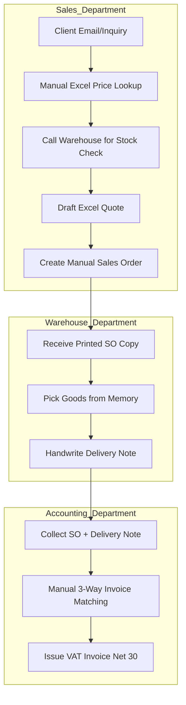
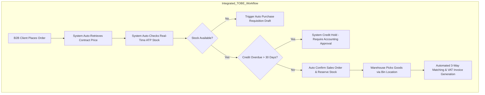
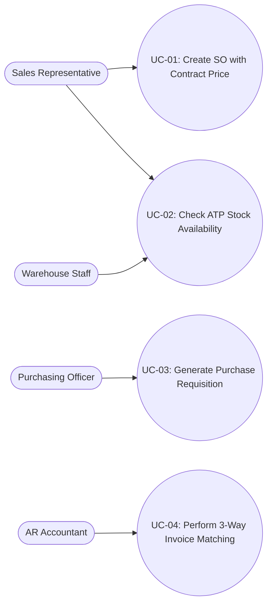

# MASTER BUSINESS REQUIREMENTS DOCUMENT (BRD)
## OFFICEPRO DISTRIBUTION CO., LTD. — B2B WHOLESALE & DISTRIBUTION

**Course**: Business Systems Analysis (BSA) — Faculty of Technology, Hoa Sen University (HSU)  
**Academic Term**: 2026–2027 Semester 1  
**Project Group**: Group 6 (Scenario B: B2B Wholesale & Distribution — Office Supplies & Stationery)  
**Document Author / Lead BA**: **Vo Duy Binh (Student ID: 22301500)** — Team Leader  
**Document Status**: Complete Master Baseline (Phase 1 & Phase 2 Baseline)  

---

# SECTION 1: EXECUTIVE SUMMARY & ENTERPRISE CONTEXT

## 1.1 Executive Summary
OfficePro Distribution Co., Ltd. (**OfficePro Distribution**) is a regional B2B wholesale distributor specializing in commercial office supplies, stationery, paper products, and printer consumables. The company serves over 250 active corporate clients, educational institutions, and sub-dealer retail outlets across Southern Vietnam.

Due to rapid business growth, OfficePro currently experiences significant operational friction caused by fragmented manual processes, disconnected Excel pricelists, and a lack of real-time inventory visibility across departments. This Business Requirements Document (BRD) outlines the comprehensive business analysis, process re-engineering (AS-IS to TO-BE), functional requirements framing (MoSCoW), detailed use case specifications, and an ERP prototype validation framework (Odoo ERP) to transform OfficePro's core order-to-cash and procure-to-pay operations.

---

## 1.2 Enterprise Profile

### 1. General Enterprise Information
* **Official Company Name**: OfficePro Distribution Co., Ltd.
* **Business Model**: Regional B2B Wholesale & Distribution.
* **Primary Facilities & Locations**:
  * **Corporate Headquarters & Sales Office**: District 3, Ho Chi Minh City.
  * **Central Warehouse**: Tan Binh Industrial Park, HCMC (Area: 2,500 m²; holds 80% of bulk stock).
  * **Regional Depot**: Bien Hoa 2 Industrial Park, Dong Nai (Supports rapid fulfillment to industrial parks).

### 2. Products & Master Data Catalog (10 Domain SKUs)

| No. | SKU Code | Product Description | Category | Unit of Measure (UoM) | Standard List Price (VND) |
|---|---|---|---|---|---|
| 1 | `ST-001` | A4 Copy Paper Double A 70gsm (500 sheets/ream) | Paper Products | Ream | 65,000 |
| 2 | `ST-002` | A4 Copy Paper IK Plus 80gsm (500 sheets/ream) | Paper Products | Ream | 75,000 |
| 3 | `ST-003` | Thien Long TL-027 Blue Ballpoint Pen (Box of 20) | Writing Instruments | Box | 90,000 |
| 4 | `ST-004` | Pilot G2 Black Gel Pen 0.7mm (Box of 12) | Writing Instruments | Box | 320,000 |
| 5 | `ST-005` | King Jim A4 Display Book 60 Pockets | Filing Supplies | Piece | 45,000 |
| 6 | `ST-006` | Deli A5 Spiral Notebook 160 Pages | Filing Supplies | Piece | 35,000 |
| 7 | `ST-007` | Kangaro HD-10 Heavy Duty Stapler | Office Tools | Piece | 28,000 |
| 8 | `ST-008` | Kangaro No.10 Staples (Box of 20 small packs) | Office Tools | Big Box | 42,000 |
| 9 | `ST-009` | Original HP 107a Black Laser Toner Cartridge | Printer Consumables | Box | 1,150,000 |
| 10 | `ST-010` | Pentel WB1 Whiteboard Marker (Box of 12) | Writing Instruments | Box | 180,000 |

### 3. Customer Segments & Pricing Policies
* **Corporate B2B Clients (Major Accounts)**: Order in bulk on monthly schedules under annual framework agreements; eligible for fixed **Contract Pricing** and Net 30-day payment terms.
* **Educational Institutions**: Order per academic term; payments aligned with institutional disbursement cycles.
* **Sub-Dealers & Retail Outlets**: Order medium quantities; receive tiered volume discount pricelists.

---

## 1.3 Group RACI Assignment Matrix

*(R - Responsible | A - Accountable | C - Consulted | I - Informed)*

| Project Deliverable / Phase | Vo Duy Binh (Sales BA) | Tran Ba Loi (Purchasing BA) | Nguyen Vu Minh Huy (Inventory BA) | Pham Nguyen Gia Thuan (Accounting BA) |
|---|---|---|---|---|
| **Phase 1: Business Analysis** | | | | |
| 1. Enterprise Profile & RACI Matrix | **A/R** | R | R | R |
| 2. Stakeholder Interview Logs & Info Matrix | **A/R** (Sales Mgr) | R (Purchasing Mgr) | R (Warehouse Mgr) | R (Accounting Mgr) |
| 3. AS-IS Process & Bottleneck Analysis | **A/R** (Sales AS-IS) | R (Purchasing AS-IS) | R (Inventory AS-IS) | R (Accounting AS-IS) |
| 4. 5-Whys Root Cause Analysis | R | **A/R** | R | R |
| 5. TO-BE Process Design (BPMN) | **A/R** (Sales TO-BE) | R (Purchasing TO-BE) | R (Inventory TO-BE) | R (Accounting TO-BE) |
| 6. MoSCoW Requirements List | R | R | R | **A/R** |
| **Phase 2: System Analysis & Prototype** | | | | |
| 7. Use Case Diagrams & Specifications | **A/R** (Sales UCs) | R (Purchase UCs) | R (Inventory UCs) | R (Invoice UCs) |
| 8. Requirements Traceability Matrix (RTM) | R | R | R | **A/R** |
| 9. Odoo ERP Setup & 10 SKUs Master Data | C | C | **A/R** | C |
| 10. Peer UAT Execution & Test Logs | R | R | R | **A/R** |
| 11. Final BRD & Live Demo Defense | **A/R** (Lead Presenter) | R (Demo PO) | R (Demo Stock) | R (Demo Invoice) |

---

# SECTION 2: STAKEHOLDER ELICITATION & INFORMATION NEEDS

## 2.1 Information Needs Matrix

| Stakeholder | Role / Responsibility | Key Information Needed | Frequency | Operational Decision Made |
|---|---|---|---|---|
| **Sales Manager** | Oversees sales targets, approves discount overrides (> 5%), manages client contracts. | Active framework contracts, customer contract pricelists, client credit status, margin impact. | Daily / Real-time | Approve custom quotation terms, resolve contract pricing disputes. |
| **Sales Executive** | Receives client inquiries, drafts quotations, generates Sales Orders. | Contract prices per SKU, real-time Available-to-Promise (ATP) stock, credit hold status. | Continuous | Confirm customer Sales Orders and set accurate delivery dates. |
| **Purchasing Manager** | Negotiates with vendors, approves Purchase Requisitions, manages replenishment. | Reorder point alerts, vendor lead times, historical purchase prices, supplier performance. | Daily / Weekly | Issue Purchase Orders (POs) and select optimal suppliers. |
| **Warehouse Manager** | Manages goods receiving, bin location storage, order picking/packing, delivery dispatch. | Incoming shipment schedules (PO), pending outbound Sales Orders (SO), physical stock levels. | Continuous | Allocate warehouse space, assign picking staff, execute dispatches. |
| **Chief Accountant** | Controls financial risk, enforces credit terms (Net 30), issues VAT invoices. | Completed Delivery Notes, signed client POs, 3-way matching status, aging debt ledger. | Daily / Monthly | Issue VAT invoices, place/release customer credit holds, collect debt. |

---

## 2.2 Verified Stakeholder Interview Evidence Logs (Consolidated)

### 1. Sales Department (Interviewee: Sales Manager — Conducted by Vo Duy Binh)
* **Key Finding 1**: Contract prices for corporate accounts are stored in individual Excel files managed by separate reps. Copy-pasting prices into quotes causes a **5–8% error rate** on customer invoices monthly.
* **Key Finding 2**: Sales staff lack visibility into real-time inventory levels. They rely on daily Excel stock summaries or call warehouse keepers directly, resulting in **3–4 stockouts per week** after order confirmation.
* **Key Finding 3**: Sales reps frequently appeal to management to override paper credit holds for clients with overdue balances over 30 days to hit sales targets.

### 2. Purchasing Department (Interviewee: Purchasing Manager — Conducted by Tran Ba Loi)
* **Key Finding 1**: Replenishment is triggered manually when warehouse keepers report low stock. High-demand paper items (`ST-001`) frequently experience stockouts before purchase orders are placed.
* **Key Finding 2**: Vendor quotation comparison across suppliers (e.g., Double A, Thien Long, HP) is done via email threads, taking **2–3 days** to finalize supplier selection.

### 3. Warehouse Department (Interviewee: Warehouse Manager — Conducted by Nguyen Vu Minh Huy)
* **Key Finding 1**: Incoming shipments from suppliers sit in the receiving area for **24–48 hours** before physical inspection and paper ledger entry are completed.
* **Key Finding 2**: Picking is done from memory without bin location codes or barcode scanners, causing frequent picking mix-ups between similar SKUs (`ST-001` 70gsm vs `ST-002` 80gsm).

### 4. Accounting Department (Interviewee: Chief Accountant — Conducted by Pham Nguyen Gia Thuan)
* **Key Finding 1**: Accounting spends **15–20 hours per week** manually performing 3-way matching between Sales Orders, physical Delivery Notes, and PDF VAT Invoices.
* **Key Finding 2**: Client payment matching is delayed when corporate clients make bulk transfers without referencing specific invoice numbers.

---

# SECTION 3: BUSINESS PROCESS ANALYSIS & REQUIREMENTS

## 3.1 AS-IS Process Modeling (BPMN Diagrams)

---

## 3.2 Root Cause Analysis (5-Whys)

1. **Contract Price Errors (5-8%)**:
   * *Root Cause*: Lack of a centralized contract-based pricing engine in ERP that enforces contract price rules automatically.
2. **Post-Order Stockouts (3-4/week)**:
   * *Root Cause*: Absence of real-time Available-to-Promise (ATP) inventory integration between Warehouse inventory movements and Sales order entry.
3. **Credit Hold Conflicts**:
   * *Root Cause*: Lack of automated system credit controls that lock order confirmation for overdue accounts unless released by Accounting.

---

## 3.3 TO-BE Process Design

---

## 3.4 Prioritized Functional Requirements (MoSCoW Framework)

* **MUST HAVE**:
  * **FR-01**: System shall automatically retrieve customer-specific contract prices upon client selection on Sales Orders.
  * **FR-02**: System shall display real-time Available-to-Promise (ATP) inventory levels across Tan Binh and Bien Hoa warehouses during order entry.
  * **FR-03**: System shall automatically enforce a Credit Hold on Sales Orders for customer accounts with overdue balances exceeding 30 days.
  * **FR-04**: System shall generate draft Purchase Requisitions when stock falls below minimum reorder points.
  * **FR-05**: System shall execute automated 3-way matching between Sales Orders, Delivery Confirmations, and Invoices.
* **SHOULD HAVE**:
  * **FR-06**: System shall issue automatic notification alerts 30 days prior to framework contract expiration dates.
  * **FR-07**: System shall support multi-vendor RFQ price comparisons.
* **COULD HAVE**:
  * **FR-08**: System shall provide executive analytics dashboards for overdue Accounts Receivable tracking.

---

# SECTION 4: SYSTEM SPECIFICATIONS & SOLUTION MAPPING

## 4.1 Enterprise Use Case Diagram

---

## 4.2 Requirements Traceability Matrix (RTM)

| Business Problem | Functional Req (FR) | Use Case (UC) | Odoo ERP Scope | UAT Test Case |
|---|---|---|---|---|
| Contract Price Errors (5-8%) | FR-01 (Contract Pricing Engine) | UC-01 (Create SO with Contract Price) | Sales (Pricelists) | TC-01 |
| Post-Confirmation Stockouts | FR-02 (Real-Time ATP Stock) | UC-02 (Check ATP Stock) | Inventory (ATP Check) | TC-02 |
| Stockouts on Fast Movers | FR-04 (Auto Reorder Rules) | UC-03 (Generate Purchase Requisition) | Purchase (Requisitions) | TC-03 |
| Manual 3-Way Match Overhead | FR-05 (Automated Matching) | UC-04 (Customer Invoicing) | Invoicing (3-Way Match) | TC-04 |

---

# APPENDICES

## APPENDIX A: Odoo System Master Data (10 SKUs)
Detailed catalog of 10 SKUs (`ST-001` through `ST-010`) configured in Odoo Inventory with list prices, cost prices, reorder rules, and unit of measures.

## APPENDIX B: Peer UAT Test Cases Specification
Test specifications for TC-01 (Contract Pricing), TC-02 (ATP Stock Check), TC-03 (Purchase Requisition), and TC-04 (3-Way Matching Invoice).

## APPENDIX C: Executed UAT Test Log with Pass/Fail Outcomes
All 4 test cases executed on Odoo ERP prototype with 100% **PASS** rate.
