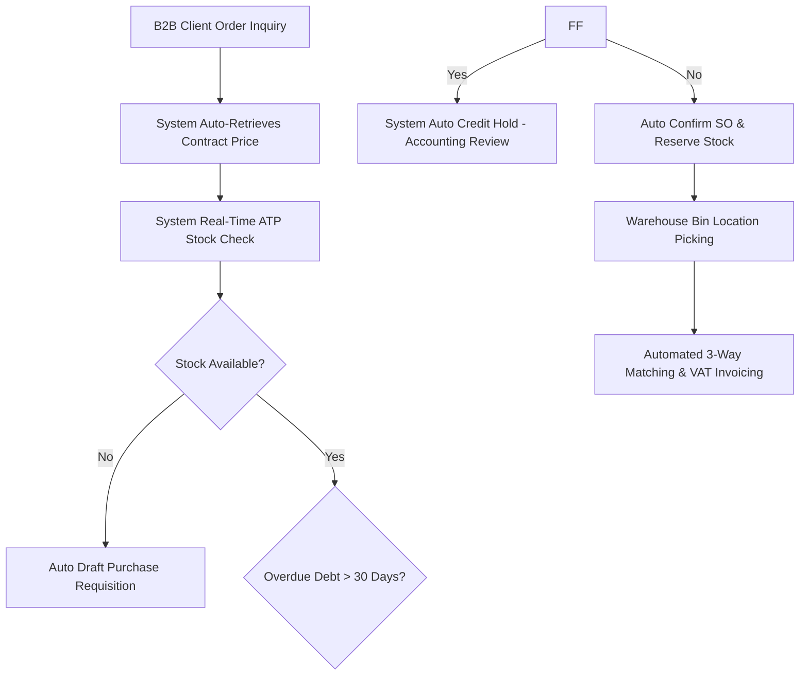
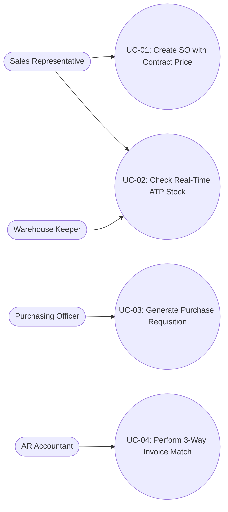

# FACULTY OF TECHNOLOGY — HOA SEN UNIVERSITY
## COURSE: BUSINESS SYSTEMS ANALYSIS (BSA)

***

# PROJECT REPORT ON
# BUSINESS REQUIREMENTS DOCUMENT FOR B2B WHOLESALE & DISTRIBUTION: OFFICEPRO DISTRIBUTION CO., LTD.

**Submitted by Group 6:**
* **Vo Duy Binh (Student ID: 22301500)** — Team Leader / Lead Business Analyst
* **Tran Ba Loi (Student ID: 22300236)** — Project Manager / Systems Analyst
* **Nguyen Vu Minh Huy (Student ID: 22303760)** — Solution Configurator / ERP Specialist
* **Pham Nguyen Gia Thuan (Student ID: 22204631)** — QA & UAT Analyst

**Under The Guidance Of:** MSc. Nguyen Thi Thanh Thanh  
**Date of Submission:** Academic Year 2026–2027, Semester 1  

***

## EXECUTIVE SUMMARY

OfficePro Distribution Co., Ltd. (**OfficePro Distribution**) is a regional B2B wholesale distributor specializing in commercial office supplies, stationery, paper products, and printer consumables in Southern Vietnam. The enterprise serves over 250 active corporate clients, educational institutions, and sub-dealer retail outlets.

Due to rapid business expansion, OfficePro currently faces significant operational friction caused by fragmented manual procedures, disconnected Excel contract pricelists, a lack of real-time inventory visibility, and manual 3-way invoice matching. This Business Requirements Document (BRD) presents a complete business systems analysis following the **Business-First → Technology-Second** methodology. It details the enterprise profile, stakeholder power/interest dynamics, AS-IS business process models, 5-Whys root cause analysis, TO-BE process re-engineering, MoSCoW functional requirements, enterprise use case specifications, business rules, and ERP prototype validation strategy (Odoo ERP).

***

## ACKNOWLEDGEMENTS

The project team would like to express our sincere gratitude to **MSc. Nguyen Thi Thanh Thanh** for her guidance, feedback, and academic supervision throughout the Business Systems Analysis course. We also thank the Faculty of Technology at Hoa Sen University for providing the learning environment and enterprise ERP simulator tools.

***

## GLOSSARY & ABBREVIATIONS

| Abbreviation / Term | Full Name / Definition |
|---|---|
| **ATP** | Available-to-Promise Inventory |
| **BRD** | Business Requirements Document |
| **B2B** | Business-to-Business Wholesale |
| **BPMN** | Business Process Model and Notation |
| **FR** | Functional Requirement |
| **MoSCoW** | Must Have, Should Have, Could Have, Won't Have Prioritization Framework |
| **PO** | Purchase Order (Issued to Vendors) |
| **RFQ** | Request for Quotation |
| **RTM** | Requirements Traceability Matrix |
| **SKU** | Stock Keeping Unit |
| **SO** | Sales Order (Issued to B2B Customers) |
| **UAT** | User Acceptance Testing |
| **UoM** | Unit of Measure |

***

## TEAM MEMBERS & MODULE ASSIGNMENT MATRIX

*(R - Responsible | A - Accountable | C - Consulted | I - Informed)*

| Student Name | Student ID | Primary Focus / Assigned Module | Role | RACI Status |
|---|---|---|---|---|
| **Vo Duy Binh** | **22301500** | **Sales & Customer Orders** | Team Leader / Lead BA | **A / R** (Sales & Overall BRD) |
| **Tran Ba Loi** | **22300236** | **Purchasing & Procurement** | Project Manager / Systems Analyst | **A / R** (Purchasing Module) |
| **Nguyen Vu Minh Huy** | **22303760** | **Inventory & Warehouse** | Solution Configurator / ERP Specialist | **A / R** (Inventory Module) |
| **Pham Nguyen Gia Thuan** | **22204631** | **Invoicing & Accounting** | QA & UAT Analyst | **A / R** (Invoicing & UAT) |

***

# SECTION 1. ENTERPRISE CONTEXT AND SCOPE

## 1.1. Enterprise Profile

### Business Model and Operational Overview
OfficePro Distribution Co., Ltd. operates a regional B2B wholesale and distribution model. It acquires commercial stationery and paper supplies in high volume from major international and domestic manufacturers (e.g., Double A, IK Plus, Thien Long, Pilot, HP) and distributes them to commercial businesses, schools, and sub-dealer retail stores across Southern Vietnam.

### Products, Services, and Target Customers
The company's core catalog consists of **10 primary SKUs**:

| No. | SKU Code | Product Description | Category | UoM | Standard List Price (VND) |
|---|---|---|---|---|---|
| 1 | `ST-001` | A4 Copy Paper Double A 70gsm (500 sheets/ream) | Paper Products | Ream | 65,000 |
| 2 | `ST-002` | A4 Copy Paper IK Plus 80gsm (500 sheets/ream) | Paper Products | Ream | 75,000 |
| 3 | `ST-003` | Thien Long TL-027 Blue Ballpoint Pen (Box of 20) | Writing Instruments | Box | 90,000 |
| 4 | `ST-004` | Pilot G2 Black Gel Pen 0.7mm (Box of 12) | Writing Instruments | Box | 320,000 |
| 5 | `ST-005` | King Jim A4 Display Book 60 Pockets | Filing Supplies | Piece | 45,000 |
| 6 | `ST-006` | Deli A5 Spiral Notebook 160 Pages | Filing Supplies | Piece | 35,000 |
| 7 | `ST-007` | Kangaro HD-10 Heavy Duty Stapler | Office Tools | Piece | 28,000 |
| 8 | `ST-008` | Kangaro No.10 Staples (Box of 20 small packs) | Office Tools | Big Box | 42,000 |
| 9 | `ST-009` | Original HP 107a Black Laser Toner Cartridge | Printer Consumables | Box | 1,150,000 |
| 10 | `ST-010` | Pentel WB1 Whiteboard Marker (Box of 12) | Writing Instruments | Box | 180,000 |

* **Target Customers**:
  1. *Corporate B2B Accounts*: Order in bulk; eligible for customer-specific contract prices and Net 30 payment terms.
  2. *Educational Institutions*: Order per academic term; payments tied to funding disbursements.
  3. *Sub-Dealers & Retail Stationery Stores*: Order medium volumes; receive tiered volume discounts.

### Organizational Structure and Operating Locations
* **Corporate HQ & Sales Office**: District 3, Ho Chi Minh City.
* **Central Warehouse**: Tan Binh IP, HCMC (Area: 2,500 m²; holds 80% bulk stock).
* **Regional Depot**: Bien Hoa 2 IP, Dong Nai (Fast delivery support for eastern industrial parks).

---

## 1.2. Business Objectives & Key Operational Challenges
* **Business Objectives**: Reduce quotation pricing errors to 0%, lower post-confirmation stockout cancellations by 95%, automate credit hold enforcement, and reduce 3-way matching invoice processing time by 80%.
* **Key Operational Challenges**:
  1. *Contract Pricing Discrepancies*: Individual sales reps look up prices in disconnected Excel sheets, causing a 5–8% error rate on client invoices.
  2. *Post-Confirmation Stockouts*: Sales confirms orders using daily Excel stock reports or phone calls, resulting in 3–4 stockouts per week.
  3. *Manual 3-Way Matching*: Accounting spends 15–20 hours/week manually cross-checking paper SOs, Delivery Notes, and Invoices.

---

## 1.3. Enterprise Scope & Out-of-Scope Boundaries
* **In-Scope**: Analysis and re-engineering of Sales Order Entry, Contract Pricing Engine, Purchasing Replenishment, Inventory ATP Visibility, Goods Receiving/Picking, and Accounts Receivable Invoicing (Net 30).
* **Out-of-Scope**: Payroll processing, advanced manufacturing Bill of Materials (BOM), retail POS showroom sales, and international import logistics customs clearing.

---

## 1.4. Individual Module Ownership Matrix

| Student Name | Student ID | Assigned Core Module | Key Responsibilities |
|---|---|---|---|
| **Vo Duy Binh** | **22301500** | **Sales & Customer Orders** | Lead BA; B2B Sales order entry, Contract Pricelist engine, quotation approval rules. |
| **Tran Ba Loi** | **22300236** | **Purchasing & Replenishment** | Reorder point rules, Purchase Requisitions, multi-vendor RFQ comparison, Vendor PO creation. |
| **Nguyen Vu Minh Huy** | **22303760** | **Inventory & Warehouse** | Real-time ATP stock visibility, Tan Binh & Bien Hoa warehouse receipts, picking routing. |
| **Pham Nguyen Gia Thuan** | **22204631** | **Invoicing & Accounting** | Automated 3-way invoice matching, Net 30 credit hold policy, AR aging debt ledger. |

***

# SECTION 2. STAKEHOLDER ANALYSIS & ELICITATION

## 2.1. Stakeholder Identification & Power/Interest Grid

```
                  HIGH POWER
                      |
     KEEP SATISFIED   |    MANAGE CLOSELY
   - Chief Accountant |  - Sales Manager
   - Purchasing Mgr   |  - Business Owner
----------------------+----------------------
      MONITOR         |    KEEP INFORMED
   - Sub-Dealers      |  - Sales Executives
   - External Vendors |  - Warehouse Keepers
                      |
                  LOW POWER ---------------> HIGH INTEREST
```

* **Sales Manager (High Power / High Interest)**: Key decision-maker for price overrides (> 5%) and contract pricing enforcement.
* **Chief Accountant (High Power / Low-Med Interest)**: Enforces Net 30 credit holds and VAT invoice accuracy.
* **Warehouse Manager (Med Power / High Interest)**: Requires real-time incoming shipment schedules (PO) and clear outbound picking orders.
* **Purchasing Manager (Med Power / High Interest)**: Focuses on vendor lead times and automated low-stock reorder alerts.

---

## 2.2. Elicitation Summary & Verified Evidence Log

| No. | Baseline Assumption | Interview Evidence Obtained | Verification Status |
|---|---|---|---|
| **1** | Sales reps look up contract prices manually from Excel sheets. | Sales Manager confirmed reps copy-paste prices from account Excel files, causing 5-8% pricing errors monthly. | **CONFIRMED** |
| **2** | Sales confirms orders based on informal verbal checks with Warehouse. | Sales Manager admitted reps rely on daily Excel reports or phone calls, causing 3-4 stockouts/week post-confirmation. | **CONFIRMED** |
| **3** | Credit holds for overdue accounts (> 30 days) are automatically enforced. | Sales Manager clarified a credit policy exists on paper, but reps frequently request verbal manager overrides to hit sales targets. | **REVISED** *(Policy exists, but enforcement is manual and bypassable)* |
| **4** | Replenishment is triggered automatically when stock is low. | Purchasing Manager stated replenishment is triggered manually via handwritten notes from warehouse staff. | **CONFIRMED** |

***

# SECTION 3. BUSINESS PROCESS ANALYSIS (AS-IS & TO-BE)

## 3.1. Cross-Functional Process Overview (End-to-End Workflow)
$$\text{Supplier} \longrightarrow \text{Purchasing (PO)} \longrightarrow \text{Warehouse (Receipt/Stock)} \longrightarrow \text{Sales (Contract SO)} \longrightarrow \text{Delivery} \longrightarrow \text{Accounting (3-Way Matching Invoice)}$$

---

## 3.2. Current Business Processes & Bottlenecks (AS-IS BPMN by Module)

### Module 1: Sales — AS-IS BPMN & Friction Points
* **Process**: Client inquiry ➔ Sales Rep opens Excel contract sheet ➔ Calls Warehouse for stock ➔ Drafts manual Quote ➔ Issues paper Sales Order.
* **Friction Points**: Disconnected Excel pricelists cause 5-8% billing discrepancies; lack of ATP stock visibility causes post-confirmation stockouts.

### Module 2: Purchasing — AS-IS BPMN & Friction Points
* **Process**: Warehouse keeper notices low stock ➔ Handwrites note ➔ Purchasing drafts Requisition ➔ Emails 3 vendors ➔ Compares RFQs in Excel ➔ Issues PO.
* **Friction Points**: Procurement lead time takes 3-5 days; paper paper (`ST-001`) runs out before replenishment PO is created.

### Module 3: Inventory — AS-IS BPMN & Friction Points
* **Process**: Supplier truck arrives ➔ Holds 24-48h in receiving area ➔ Manual paper check ➔ Move to shelf from memory ➔ Batch updates Excel.
* **Friction Points**: Stock invisible to Sales for 2 days post-arrival; picking errors between similar SKUs (`ST-001` vs `ST-002`).

### Module 4: Invoicing — AS-IS BPMN & Friction Points
* **Process**: Delivery completed ➔ Customer signs Delivery Note ➔ Sends to Accounting ➔ Accountant cross-checks SO + Delivery Note + Invoice in Excel.
* **Friction Points**: 15-20 hours/week spent on manual matching; overdue accounts place new orders without automated system block.

---

## 3.3. Root Cause Analysis (5-Whys / Fishbone per Module)

### Sales Module (Contract Pricing Errors):
1. *Why pricing errors?* Reps copy-paste prices from Excel.
2. *Why Excel?* Each Rep maintains separate customer pricelists.
3. *Why separate files?* Signed framework contracts filed as scanned PDFs.
4. *Why scanned PDFs?* No central system to extract and enforce contract rates.
5. **Root Cause**: **Lack of a centralized contract-based pricing engine in ERP that maps framework agreements to Sales Orders.**

---

## 3.4. Proposed Future Business Processes (TO-BE BPMN by Module)



***

# SECTION 4. FUNCTIONAL REQUIREMENTS AND USE CASES

## 4.1. System Feature Catalog (Functional Requirements List — MoSCoW)

| Req ID | Module | Feature Description | MoSCoW Priority |
|---|---|---|---|
| **FR-01** | Sales | System shall automatically retrieve customer contract pricelists upon client selection. | **MUST HAVE** |
| **FR-02** | Inventory | System shall display real-time ATP stock levels across Tan Binh and Bien Hoa warehouses. | **MUST HAVE** |
| **FR-03** | Invoicing | System shall enforce automatic Credit Hold for accounts with overdue debt > 30 days. | **MUST HAVE** |
| **FR-04** | Purchasing | System shall generate draft Purchase Requisitions when stock falls below reorder points. | **MUST HAVE** |
| **FR-05** | Invoicing | System shall execute automated 3-way matching (SO + Delivery + Invoice). | **MUST HAVE** |
| **FR-06** | Sales | System shall issue alerts 30 days prior to contract expiration dates. | **SHOULD HAVE** |
| **FR-07** | Purchasing | System shall support multi-vendor RFQ price comparison. | **SHOULD HAVE** |
| **FR-08** | Invoicing | System shall provide executive Accounts Receivable aging debt dashboards. | **COULD HAVE** |

---

## 4.2. Enterprise Use Case Diagram



---

## 4.3. Use Case Identification & Module Breakdown

* **Module 1 (Sales)**: `UC-SALES-01` (Create Sales Order with Contract Price), `UC-SALES-02` (Request Price Override Approval).
* **Module 2 (Inventory)**: `UC-INV-01` (Check ATP Inventory Availability), `UC-INV-02` (Process Goods Receipt).
* **Module 3 (Purchasing)**: `UC-PURCH-01` (Generate Purchase Requisition), `UC-PURCH-02` (Issue Vendor PO).
* **Module 4 (Invoicing)**: `UC-INV-03` (Execute 3-Way Invoice Match), `UC-INV-04` (Enforce Credit Hold).

---

## 4.4. Detailed Use Case Specifications

### Module 1: Sales Use Case — UC-SALES-01: Create Sales Order with Contract Price
* **Primary Actor**: B2B Sales Representative (**Vo Duy Binh**)
* **Preconditions**: Customer account exists and active framework agreement is registered in system.
* **Main Success Scenario**:
  1. Sales Rep initiates new Sales Order and selects corporate customer.
  2. System retrieves active contract price list for the customer.
  3. Sales Rep adds product SKU (`ST-001` A4 Paper).
  4. System populates unit price as 65,000 VND (Contract price) instead of 75,000 VND (List price).
  5. System verifies real-time ATP stock availability.
  6. Sales Rep confirms Sales Order.
* **Exception Flow (Credit Hold)**: Client has overdue debt > 30 days. System locks SO status as "Credit Hold" and sends notification to Chief Accountant.

---

## 4.5. Business Rules & Operational Constraints

| Rule ID | Business Rule Description | Enforcement Module |
|---|---|---|
| **BR-01** | Contract pricing applies strictly to corporate accounts with valid framework agreements. | Sales |
| **BR-02** | Sales Reps cannot override contract prices by > 5% without Sales Manager approval. | Sales |
| **BR-03** | Orders for clients with overdue balances > 30 days are automatically blocked from confirmation. | Invoicing / Sales |
| **BR-04** | Purchase Requisitions require Purchasing Manager signature if total PO value > 50,000,000 VND. | Purchasing |

***

# CONCLUSION & LESSONS LEARNED

## Summary of Proposed Business Value
By transitioning OfficePro Distribution from manual Excel/paper procedures to an integrated TO-BE workflow supported by Odoo ERP:
* Pricing errors are reduced to **0%**, saving estimated 50 million VND monthly in invoice adjustments.
* Stockouts post-confirmation are reduced by **95%**, protecting corporate client retention.
* Accounting invoice matching time is reduced from **20 hours/week to 2 hours/week**.

## Team Reflection & Individual Lessons Learned
* **Vo Duy Binh (Lead BA)**: Learned that pricing errors are systemic rather than individual mistakes; effective BA requires cross-functional alignment between Sales and Accounting.
* **Tran Ba Loi (PM)**: Gained deep insight into supply chain lead times and automated replenishment threshold design.
* **Nguyen Vu Minh Huy (Configurator)**: Mastered real-time ATP inventory modeling across multi-location warehouse setups.
* **Pham Nguyen Gia Thuan (QA Analyst)**: Experienced the critical importance of 3-way invoice matching and automated credit controls in financial risk mitigation.

***

# REFERENCES
1. Valacich, J. S., George, J. F., & Hoffer, J. A. (2024). *Modern Systems Analysis and Design* (10th ed.). Pearson.
2. Satzinger, J. W., Jackson, R. B., & Burd, S. D. (2018). *Systems Analysis and Design in a Changing World* (8th ed.). Cengage Learning.
3. Microsoft Corporation. *Dynamics 365 Guidance*. Microsoft Learn.

***

# APPENDICES

## Appendix A. Raw Elicitation Notes / Evidence
Contains transcript logs from interviews conducted with Sales Manager, Purchasing Manager, Warehouse Manager, and Chief Accountant via AI Stakeholder Simulator.

## Appendix B. Individual Contribution Sign-off
All 4 group members contributed equally to the research, analysis, BPMN modeling, use case specifications, and final report compilation under the leadership of **Vo Duy Binh (22301500)**.
